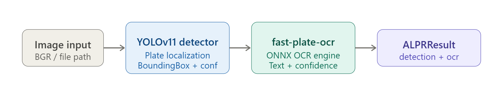

# ANPR — Automatic Number Plate Recognition

A modular two-stage pipeline for license plate detection and OCR, built on YOLOv11 and `fast-plate-ocr`.

## Pipeline

```
Image → YOLOv11 Detector → Crop → ONNX OCR → ALPRResult
```

## Installation

```bash
pip install ultralytics fast-plate-ocr opencv-python onnxruntime
```

## Quick Start

```python
from src.anpr import ALPR
from src.config import PlateDetectionModel

alpr = ALPR(detector_model=PlateDetectionModel, ocr_device="cpu")
results = alpr.predict("car.jpg")

for r in results:
    print(r.ocr.text, r.ocr.confidence)
```

Or use the high-level API:

```python
from src.inference import recognize_license_plate, plate_crop

result = recognize_license_plate("car.jpg")
# {"license_plate": "ABC123", "confidence": 0.94, "x": 310, "y": 220, ...}

plate_crop(result, "car.jpg", "plate.jpg")
```

## Project Structure

```
src/
├── anpr.py        # ALPR orchestrator (predict, draw_predictions)
├── detector.py    # Yolov11ObjectDetector (BaseDetector)
├── default_ocr.py # DefaultOCR via fast-plate-ocr (BaseOCR)
├── inference.py   # recognize_license_plate(), plate_crop()
└── config.py      # PlateDetectionModel path config
core/
└── base.py        # BaseDetector, BaseOCR, BoundingBox, DetectionResult, OcrResult
```

## Key Components

| Component | Class | Role |
|---|---|---|
| Detector | `Yolov11ObjectDetector` | Plate localization via YOLOv11 |
| OCR | `DefaultOCR` | Character recognition via ONNX |
| Orchestrator | `ALPR` | Combines both stages |
| Result | `ALPRResult` | Frozen dataclass: `detection` + `ocr` |

## Configuration

```python
ALPR(
    detector_model=PlateDetectionModel,  # path to .pt / .onnx weights
    ocr_model="global-plates-mobile-vit-v2-model",
    ocr_device="auto",  # "cuda" | "cpu" | "auto"
)
```

## Output Schema

```python
{
  "license_plate": str,   # extracted text
  "confidence":    float, # detection confidence (0–1)
  "x": int, "y": int,     # bounding box center
  "width": int, "height": int,
  "coordinate": {"x1", "y1", "x2", "y2"},
  "status": str           # application-level field
}
```

## Design Notes

- **Abstraction-first**: `BaseDetector` and `BaseOCR` allow drop-in replacement of either stage
- **Bounding box clamping**: coordinates are clipped to frame dimensions before cropping
- **Grayscale preprocessing**: BGR → gray before OCR to match model training distribution
- **Highest-confidence selection**: `recognize_license_plate()` returns only the top detection

## Dependencies

- [`ultralytics`](https://github.com/ultralytics/ultralytics) — YOLOv11
- [`fast-plate-ocr`](https://github.com/ankandrew/fast-plate-ocr) — ONNX plate OCR
- `onnxruntime`, `opencv-python`, `numpy`